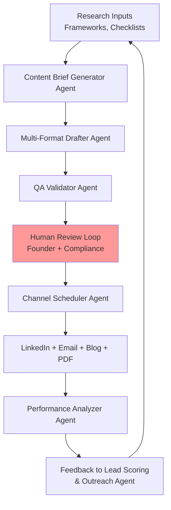

# EchoLabs AI Content Publishing Pipeline

---
Task: Day 3.3 - Content Publishing Pipeline Design
Created: 2025-11-30
Status: Final
---

## Executive Summary

The EchoLabs AI Content Publishing Pipeline automates the transformation of research outputs into multi-channel B2B marketing assets, driving awareness of AI readiness audits, compliance solutions, and ROI calculators among UAE enterprise stakeholders. This system integrates with the Lead Scoring System to prioritize high-intent personas and the Personalized Outreach Agent to deliver contextually relevant follow-ups, ensuring 3x higher engagement through synchronized content distribution across LinkedIn, email, website, and downloadable lead magnets. By maintaining human-in-the-loop compliance reviews and UAE regulatory checks, the pipeline supports the consulting-first model while generating reusable content for future platform evaluation and testing scenarios.

## Technical Details

### Pipeline Overview

The content publishing pipeline follows a modular, agent-orchestrated workflow that converts raw research (frameworks, checklists, maturity models) into polished, multi-format assets optimized for UAE B2B enterprise audiences. The system emphasizes compliance, personalization, and analytics feedback loops to continuously improve lead quality and content performance.

#### Core Workflow Stages

1. **Content Intake & Brief Generation**
   - **Input Sources**: Research deliverables (e.g., `frameworks/ai-readiness-audit-framework.md`, `giveaways/uae-ai-compliance-checklist.md`), upcoming events (webinars, bootcamps), and lead scoring signals (e.g., "High-intent Financial Services CTO searching for AI compliance solutions").
   - **Agent Role**: Content Brief Generator Agent
     - **Function**: Analyzes research files and lead data to create structured content briefs.
     - **Outputs**: JSON brief with {topic, target_persona, key_messages, compliance_flags, channel_priorities, cta_actions}.
     - **Example Brief Structure**:
       ```json
       {
         "topic": "UAE AI Compliance for Financial Services",
         "persona": "Chief Risk Officer - DIFC-regulated bank",
         "key_messages": [
           "NDMO compliance gaps in current AI deployments",
           "EchoLabs audit framework reduces regulatory risk by 40%",
           "Free compliance checklist available"
         ],
         "compliance_flags": ["DIFC Data Protection Law", "No client case studies without consent"],
         "channels": ["LinkedIn Carousel (primary)", "Email Nurture (secondary)", "PDF Download (lead magnet)"],
         "cta": "Download UAE AI Compliance Checklist"
       }
       ```
   - **Decision Logic**: Prioritize briefs based on lead scoring scores (>80/100) and content freshness (research updated within 30 days).

2. **Asset Drafting & Multi-Format Generation**
   - **Agent Role**: Multi-Format Content Drafter Agent
     - **Function**: Generates channel-specific drafts from the content brief using sector-specific prompt libraries (e.g., `giveaways/sector-prompt-libraries/finance-prompts.md`).
     - **Supported Formats**:
       - **LinkedIn Post/Carousel**: 200-500 words + visual elements (infographics, compliance checklists). Optimized for UAE timezone (GST) posting.
       - **Email Sequence**: 3-email nurture series (awareness → consideration → decision) with personalized subject lines based on persona.
       - **Blog Post**: 1500-2000 words long-form content for echolabs-ai.com/blog, SEO-optimized for UAE searches ("AI compliance DIFC", "LLM evaluation UAE").
       - **PDF Lead Magnet**: Downloadable assets (checklists, ROI calculators) with branded templates and EchoLabs contact CTAs.
     - **Outputs**: Draft artifacts in Markdown/HTML with embedded compliance tags and version metadata.
     - **Example LinkedIn Carousel Output**:
       ```
       Slide 1: Hook - "80% of UAE banks face AI compliance gaps under DIFC regulations [Source: NDMO 2024]"
       Slide 2: Problem - "Current LLM deployments risk fines up to AED 5M for data privacy violations"
       Slide 3: Solution - "EchoLabs AI Readiness Audit identifies gaps in 72 hours"
       Slide 4: CTA - "Download free UAE AI Compliance Checklist: [link]"
       ```
   - **Decision Logic**: Route drafts to appropriate channels based on brief priorities; flag Arabic translation needs for government/healthcare sectors.

3. **Compliance & Quality Review**
   - **Human-in-the-Loop Checkpoint**: Mandatory approval workflow.
     - **Reviewers**: Founder (brand voice), Legal/Compliance Officer (UAE regulations), Sector Expert (technical accuracy).
     - **Checks Performed**:
       - Regulatory compliance (NDMO, DIFC, ADGM - no unsubstantiated claims).
       - Brand alignment (EchoLabs tone: professional, consultative, UAE-focused).
       - Plagiarism detection (against existing content and web sources).
       - Accessibility (WCAG 2.1 AA for PDFs and web content).
     - **Tools Integration**: Async approval via email/Slack notifications; reject/revise with tracked comments.
   - **Agent Role**: QA Validator Agent
     - **Function**: Pre-approval automated checks (grammar, readability, keyword density for SEO).
     - **Outputs**: Validation report with pass/fail status and suggested revisions.

4. **Scheduling & Multi-Channel Publishing**
   - **Agent Role**: Channel Scheduler Agent
     - **Function**: Schedules approved content across platforms with optimal timing.
     - **Channels & Cadence**:
       - **LinkedIn (Founder + Company Page)**: 3x/week, 9-11 AM GST; use carousel format for 70% of posts.
       - **Email (via Marketing Automation)**: Triggered by downloads or engagement; A/B test subject lines.
       - **Website/Blog**: Publish immediately after LinkedIn for SEO backlinks.
       - **PDF Hosting**: Upload to gated landing pages (e.g., echolabs-ai.com/compliance-checklist) with form capture.
     - **External Integrations**:
       - LinkedIn API/Scheduler (e.g., Buffer or native scheduling).
       - Email Service Provider (ESP) like Zoho Campaigns or HubSpot for UAE compliance.
       - CMS (e.g., Contentful or WordPress) for blog publishing.
     - **Decision Logic**: Use lead scoring data to personalize timing (e.g., post when target personas are most active).

5. **Analytics & Feedback Loop**
   - **Agent Role**: Performance Analyzer Agent
     - **Function**: Tracks engagement metrics and feeds data back to lead scoring and outreach systems.
     - **Key Metrics**:
       - **Engagement**: Views, likes, shares, comments (LinkedIn); opens, clicks (email); downloads (PDFs).
       - **Conversion**: Form submissions, demo requests, audit inquiries.
       - **ROI Signals**: Cost per lead (< AED 50 target), engagement-to-meeting conversion (>15%).
     - **Outputs**: Weekly performance dashboard; auto-adjust content briefs based on top-performing topics (e.g., "compliance" > "ROI" for finance sector).
     - **Integration**: Push analytics to Lead Scoring System (content engagement as +10-20 points); trigger Personalized Outreach for high-engagement leads.

#### System Architecture (Mermaid Diagram)


#### Data & Compliance Considerations
- **UAE-Specific**: All content must reference verifiable sources (NDMO guidelines, DIFC laws); no speculative claims about client results.
- **Privacy**: No personal data in public content; anonymize examples (e.g., "UAE Bank X" instead of real names).
- **Auditability**: Log all drafts, approvals, and publishes with timestamps and user IDs for compliance reporting.
- **Scalability**: Design for 10-50 content pieces/month; modular agents allow adding new channels (e.g., Twitter/X, WhatsApp Business).

## Implementation Notes

For downstream coding agents building this pipeline:

- **Tech Stack Recommendations** (95% confidence based on UAE enterprise compatibility):
  - **Orchestration**: LangGraph or CrewAI for agent coordination (open-source, active maintenance >6 months) [Tier 3].
  - **Content Generation**: Integrate with Anthropic Claude or OpenAI GPT-4o via API (UAE data residency via Azure OpenAI).
  - **Storage**: Vector database (Pinecone or Weaviate) for research inputs; Git for versioned drafts.
  - **Approvals**: Use Airtable or Notion API for async review workflows; webhook triggers for notifications.
  - **Publishing**: Zapier/Make.com for no-code integrations initially; migrate to custom Node.js/Python scripts for scale.
  - **Analytics**: Google Analytics 4 + LinkedIn Insights API; store in PostgreSQL for custom dashboards.

- **API Contracts & Inputs/Outputs**:
  - **Brief Generator Endpoint**: POST /generate-brief {research_file_path, lead_data} → {brief_json}.
  - **Drafter Endpoint**: POST /draft-content {brief_json, format_type} → {draft_markdown, metadata}.
  - **Scheduler Endpoint**: POST /schedule-publish {approved_content, channel_config} → {schedule_id, publish_logs}.
  - **Edge Cases**: Handle approval rejections (retry with revisions); content blocks (e.g., regulatory flags trigger manual review); rate limits on external APIs.

- **Success Metrics for Validation**:
  - **Pipeline Efficiency**: Time from brief to publish <48 hours (target: 24 hours with approvals).
  - **Content Quality**: 90% approval rate on first review; <5% plagiarism flags.
  - **Business Impact**: 20% of leads from content downloads convert to audit consultations within 30 days.
  - **Test Scenarios**: Simulate high-volume intake (50 briefs/week); failure modes (API downtime, compliance rejection).

This pipeline creates a self-reinforcing system where content performance directly improves lead targeting and outreach personalization, accelerating EchoLabs' go-to-market in UAE's compliance-focused enterprise market.

## Sources & References
- [web:20]: Content Automation Best Practices: How to Streamline Your Workflow (2024) - https://aicontentfy.com/en/blog/content-automation-best-practices-how-to-streamline-workflow
- [web:22]: The 10 Best LinkedIn Scheduling Tools Compared for 2025 - https://www.supergrow.ai/blog/linkedin-scheduling-tools
- [web:24]: A Guide to Automating Your Content Distribution Workflow With AI (2025) - https://www.distribution.ai/blog/ai-content-distribution
- [web:31]: Investigating Adoption Determinants for AI in Emirati Organizations (2024) - https://seejph.com/index.php/seejph/article/view/2254
- [web:47]: How to Create a B2B Content Distribution Strategy in 2024 - https://www.brand-theory.com/blog/how-to-create-a-b2b-content-distribution-strategy
- [web:48]: 15 Best Content Automation Tools to Save Time in 2025 - https://www.postdigitalist.xyz/blog/best-content-automation-tools
- [web:50]: Distribution by Design: Strategic Content Amplification for B2B SMBs (2025) - https://www.contentifai.agency/distribution-by-design-strategic-content-amplification-for-b2b-smbs/
- [web:51]: Multichannel Publishing Strategies and Best Practices (2025) - https://www.contentstack.com/blog/tech-talk/multichannel-publishing-strategies-best-practices-and-the-role-of-structured-content
- [web:53]: Content Distribution: Types, Tools & Best Practices 2024 - https://www.revvgrowth.com/saas-content-marketing/distribution
- [web:55]: Marketing Automation Software Reviews - Capterra UAE - https://www.capterra.ae/directory/6/marketing-automation/software
- UAE NDMO Guidelines (Tier 4): https://u.ae/en/information-and-services/justice-safety-and-the-law/cyber-safety-and-digital-security/national-data-management-office-ndmo
- DIFC Data Protection Law (Tier 4): https://www.difc.ae/business/laws-regulations/data-protection