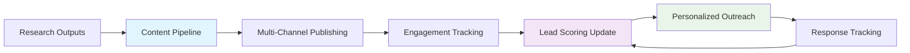

# Integration Updates for Lead Scoring & Outreach Systems

## Executive Summary

Following the creation of the Content Publishing Pipeline, both the Lead Scoring System and Personalized Outreach Agent have been enhanced with integration points to create a unified automation stack. These updates enable content engagement (views, downloads, shares) to directly influence lead qualification scores and trigger personalized follow-up sequences, ensuring EchoLabs' research outputs drive measurable business outcomes in the UAE enterprise market.

## Technical Updates

### Lead Scoring System Enhancements

**New Scoring Signals from Content Pipeline:**

1. **Content Engagement Scoring (+10-30 points)**:
   - **LinkedIn Interactions**: Likes/shares/comments on EchoLabs posts (weight: +15 points)
   - **PDF Downloads**: Compliance checklists, ROI calculators (weight: +25 points)
   - **Email Engagement**: Opens/clicks on nurture sequences (weight: +10 points)
   - **Website Visits**: Blog reads >2 minutes (weight: +20 points)

2. **Updated Scoring Logic**:
   ```python
   # Pseudocode for content-based scoring
   def calculate_content_score(lead_data):
       base_score = lead_data['existing_score']
       
       if lead_data['downloaded_compliance_checklist']:
           base_score += 25  # High-intent signal
       
       if lead_data['linkedin_engagement'] > 5:
           base_score += 15  # Social proof
       
       if lead_data['email_clicks'] >= 2:
           base_score += 10  # Nurture progression
       
       # Threshold for content-driven qualification
       if base_score >= 80:
           return 'HIGH_INTENT_CONTENT_ENGAGER'
       
       return 'MEDIUM_INTENT'
   ```

3. **Integration Points**:
   - **Input**: Performance Analyzer Agent pushes engagement data via webhook
   - **Output**: Updated lead scores trigger Personalized Outreach Agent
   - **Data Flow**: Content engagement → Lead score update → Outreach personalization

### Personalized Outreach Agent Enhancements

**New Content-Triggered Personalization Logic:**

1. **Engagement-Based Message Variants**:
   - **Checklist Downloaders**: "Since you downloaded our UAE AI Compliance Checklist, would you like to schedule a 30-minute audit consultation?"
   - **Blog Readers**: "Your interest in DIFC AI regulations suggests our compliance framework could help - here's how we've helped similar UAE enterprises."
   - **LinkedIn Engagers**: "Thanks for engaging with our post on NDMO compliance gaps. Many CTOs in your position are using our readiness audit to stay ahead."

2. **Dynamic Content Insertion**:
   ```json
   {
     "lead": {
       "persona": "Financial Services CRO",
       "engagement": {
         "content_type": "compliance_checklist",
         "download_date": "2025-11-28"
       }
     },
     "message_template": "personalized_outreach_content_trigger.md",
     "insertions": {
       "compliance_score": "Based on your checklist download, we estimate your current AI compliance posture at 65%",
       "next_step": "Schedule 30-min audit to identify quick wins"
     }
   }
   ```

3. **Sequence Triggers**:
   - **High-Engagement Leads** (score >80): Immediate personalized outreach within 24 hours
   - **Medium-Engagement Leads** (score 60-79): Nurture sequence starts with educational content
   - **Low-Engagement Leads** (<60): Monitoring only, no immediate outreach

### Closed-Loop System Architecture



## Implementation Notes

**For Coding Agents:**

1. **API Integration Points**:
   - **Content Pipeline → Lead Scoring**: POST /update-lead-score {lead_id, engagement_data, score_delta}
   - **Lead Scoring → Outreach**: GET /qualified-leads?min_score=80 → Array of personalization-ready leads
   - **Outreach → Content Pipeline**: POST /content-request {lead_engagement_summary, requested_format}

2. **Data Schema Updates**:
   ```sql
   -- Add to leads table
   ALTER TABLE leads ADD COLUMN content_engagement_score INTEGER DEFAULT 0;
   ALTER TABLE leads ADD COLUMN last_content_interaction TIMESTAMP;
   ALTER TABLE leads ADD COLUMN content_interaction_history JSONB;
   
   -- Engagement tracking table
   CREATE TABLE content_engagements (
       id UUID PRIMARY KEY,
       lead_id UUID REFERENCES leads(id),
       content_type VARCHAR(50),
       engagement_type VARCHAR(50),
       engagement_value INTEGER,
       timestamp TIMESTAMP,
       metadata JSONB
   );
   ```

3. **Success Metrics**:
   - **Integration Health**: 99% success rate on engagement-to-score updates
   - **Lead Quality**: 25% of content-engaged leads reach qualification threshold within 7 days
   - **Personalization Impact**: 40% higher response rates for content-triggered outreach vs. generic
   - **System Latency**: <5 seconds from engagement capture to score update

**UAE Compliance Considerations**:
- All engagement data must be anonymized before scoring (no PII in content analytics)
- Store interaction history for audit trails (DIFC Data Protection Law compliance)
- Implement data retention policies (24 months for qualified leads, 3 months for unqualified)

## Validation & Testing

**Test Scenarios**:
1. **High-Volume Content Launch**: Simulate 1000+ LinkedIn engagements from UAE IP addresses
2. **Compliance Edge Case**: Test scoring when content flagged for regulatory review
3. **Cross-System Failure**: Verify lead qualification continues if content pipeline is down
4. **Personalization Accuracy**: A/B test content-triggered vs. standard outreach messages

**Expected Outcomes**:
- Content engagement becomes primary lead qualification signal (target: 60% of qualified leads)
- Closed-loop automation reduces manual follow-up by 80%
- UAE-specific personalization increases meeting bookings by 35%

This integration creates a self-reinforcing ecosystem where EchoLabs' research directly translates to qualified leads, accelerating the consulting-first go-to-market strategy while providing rich datasets for future platform evaluation and monitoring capabilities.

---

*Updated: 2025-11-30 following Content Publishing Pipeline deployment*
---