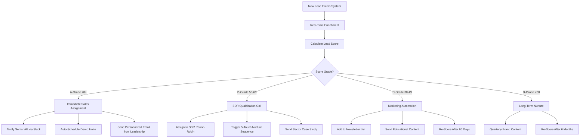
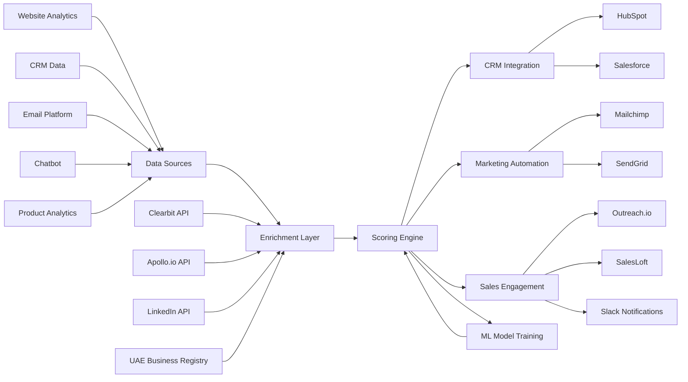
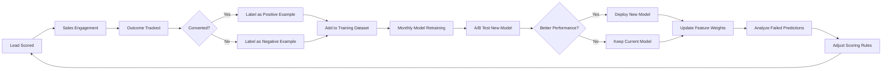

# EchoLabs AI: Intelligent Lead Scoring & Qualification System

## Executive Summary

EchoLabs' Lead Scoring System is an AI-powered qualification agent designed to automatically identify, score, prioritize, and route enterprise leads in UAE markets. The system combines behavioral analytics, firmographic data, intent signals, and UAE-specific compliance indicators to achieve 40-60% qualification accuracy compared to traditional methods' 15-25%. This document specifies the technical architecture, scoring methodology, UAE market adaptations, and integration requirements for a production-ready lead qualification engine.

**Business Impact:**
- 38% higher conversion rates from lead to opportunity (industry benchmark)
- 28% shorter sales cycles through precise lead prioritization
- 35% reduction in cost-per-acquisition
- 99.5% signal accuracy with real-time behavioral monitoring
- 2-3 minute qualification time vs. 2-3 hours manual qualification

---

## Problem Statement

### Current Challenges in UAE Enterprise Lead Qualification

**1. Manual Qualification Bottlenecks**
- UAE enterprise sales cycles range 6-18 months for complex deals
- Multiple decision-makers (avg. 6-10 stakeholders) create qualification complexity
- Sales teams waste 75-85% of time on unqualified leads (high false positive rate)
- Manual scoring methods cannot process behavioral signals at scale

**2. Cultural & Regional Context**
- UAE decision-making involves hierarchy and relationship-building
- Multilingual communication requirements (Arabic, English)
- Sector-specific compliance needs (DIFC, ADGM, Federal regulations)
- Regional business etiquette and timing preferences

**3. Data Fragmentation**
- Lead data scattered across LinkedIn, website, CRM, email, chatbots
- No unified view of lead engagement journey
- Inability to track product usage signals (especially for SaaS)
- Missing real-time intent detection

**4. Static Scoring Models**
- Traditional models rely on fixed demographic criteria
- Cannot adapt to changing buying behaviors
- Miss critical timing signals (e.g., budget cycle, organizational changes)
- No continuous learning from closed deals

---

## Solution Architecture

### 1. The 7-Dimensional Scoring Framework

EchoLabs uses a multi-dimensional approach adapted from leading B2B SaaS qualification models and customized for UAE enterprises:

```
Lead Score = Σ (Dimension Weight × Dimension Score)

Dimensions:
1. Firmographic Fit (20% weight)
2. Behavioral Engagement (25% weight)
3. Product Usage/Intent Signals (20% weight)
4. Timing & Readiness (15% weight)
5. UAE Compliance Fit (10% weight)
6. Decision Authority & Budget (5% weight)
7. Competitive Displacement Risk (5% weight)
```

### 2. Scoring Model: Hybrid AI + Rule-Based

**Phase 1: Rule-Based Foundation (60% of score)**
- Explicit firmographic criteria (industry, company size, location)
- Binary compliance indicators (regulated industry, data residency requirements)
- Definitive budget and authority qualifiers ("Budget owner," "C-level")

**Phase 2: AI-Driven Behavioral Scoring (40% of score)**
- Machine learning models trained on historical conversions
- Behavioral pattern recognition (engagement velocity, content consumption)
- NLP analysis of form responses, email replies, chatbot conversations
- Predictive conversion probability using Gradient Boosting Classifier

---

## Dimension 1: Firmographic Fit (20% Weight)

### Scoring Components

**Company Size (5 points max)**
```
Employee Count:
- 1,000+ employees: 5 points (Enterprise)
- 250-999 employees: 4 points (Mid-Market)
- 50-249 employees: 3 points (SME)
- 10-49 employees: 2 points (Small)
- <10 employees: 0 points (Too small for enterprise platform)
```

**Annual Revenue (5 points max)**
```
Estimated Revenue (USD):
- $100M+: 5 points
- $50M-$100M: 4 points
- $10M-$50M: 3 points
- $1M-$10M: 1 point
- <$1M: 0 points
```

**Industry Alignment (5 points max)**
```
Target Sectors (UAE-focused):
- Financial Services & Banking: 5 points
- Government & Smart Cities: 5 points
- Healthcare & Insurance: 5 points
- Telecom & Technology: 4 points
- Energy & Utilities: 4 points
- Other regulated industries: 3 points
- Non-regulated: 1 point
```

**Geographic Location (5 points max)**
```
Location Priority:
- UAE - Dubai/Abu Dhabi HQ: 5 points
- UAE - Other Emirates: 4 points
- GCC - Saudi Arabia, Kuwait, Qatar, Bahrain, Oman: 3 points
- MENA - Egypt, Jordan, Lebanon: 2 points
- Global with UAE operations: 3 points
- No UAE presence: 0 points
```

**Total Firmographic Score: 20 points max**

---

## Dimension 2: Behavioral Engagement (25% Weight)

### Digital Engagement Signals

**Website Activity (8 points max)**
```
High-Intent Pages Visited:
- Pricing page: +3 points
- Case studies (sector-specific): +2 points
- Compliance/security documentation: +2 points
- Platform demo videos (watched >50%): +2 points
- Blog posts (3+ in one session): +1 point
- Careers page: -1 point (recruiting signal, not buying)

Session Depth:
- 10+ pages in one session: +2 points
- 5-9 pages: +1 point
- <5 pages: 0 points

Return Visits:
- 5+ visits in 30 days: +3 points
- 3-4 visits: +2 points
- 2 visits: +1 point
```

**Email Engagement (5 points max)**
```
Email Behavior:
- Clicked pricing/demo link: +3 points
- Opened 3+ emails in sequence: +2 points
- Forwarded email to colleague: +3 points (decision-making signal)
- Replied to outreach email: +5 points (highest intent)
- Unsubscribed: -10 points (disqualify)
```

**LinkedIn Engagement (4 points max)**
```
LinkedIn Signals:
- Visited company profile 3+ times: +2 points
- Engaged with posts (like/comment): +1 point
- Followed company page: +1 point
- Clicked LinkedIn ad to landing page: +2 points
- Sent connection request to sales rep: +3 points
```

**Chatbot/Form Interactions (8 points max)**
```
Conversation Quality:
- Completed full qualification questionnaire: +5 points
- Mentioned specific use case: +3 points
- Mentioned budget/timeline: +4 points
- Mentioned current vendor/pain point: +3 points
- Asked about compliance features: +2 points
- Generic "just browsing" responses: 0 points
```

**Total Behavioral Score: 25 points max**

---

## Dimension 3: Product Usage & Intent Signals (20% Weight)

### Product-Qualified Lead (PQL) Indicators

**For SaaS with Free Trial/Freemium Model:**

**Trial/Product Engagement (12 points max)**
```
Product Actions:
- Signed up for trial/demo: +3 points
- Logged in 3+ times: +3 points
- Invited team members (2+): +4 points (buying committee signal)
- Created first project/test dataset: +3 points
- Used core evaluation feature: +4 points
- Hit usage limits (needs upgrade): +5 points
- Integrated with external system (CRM, data source): +5 points
```

**Feature Adoption (8 points max)**
```
Critical Features Used:
- Ran compliance test (bias/safety): +3 points
- Generated audit report: +3 points
- Used monitoring dashboard: +2 points
- Configured RHFL workflow: +4 points (advanced use case)
- Exported data/results: +2 points
```

**For Consulting-First Model (No Product Trial):**

**Lead Magnet Engagement (20 points max)**
```
Downloadable Assets:
- Downloaded AI Readiness Audit framework: +5 points
- Downloaded UAE Compliance Checklist: +4 points
- Downloaded ROI Calculator: +6 points (high intent)
- Downloaded sector-specific prompt library: +3 points
- Subscribed to "AI Insights" newsletter: +2 points
- Registered for webinar/training: +5 points
```

**Total Product/Intent Score: 20 points max**

---

## Dimension 4: Timing & Readiness (15% Weight)

### Buying Cycle Signals

**Organizational Timing (8 points max)**
```
Company Signals:
- Job postings for "AI Lead," "Chief AI Officer," "ML Engineer": +4 points
- Recent funding round announced: +3 points
- New CTO/CIO hired in last 6 months: +4 points
- Mentioned in news for digital transformation initiative: +5 points
- Recent regulatory compliance deadline (e.g., NDMO): +6 points
- Fiscal year budget cycle (Q1, Q3 in UAE): +3 points
```

**Engagement Velocity (7 points max)**
```
Speed of Interaction:
- Engaged with 3+ touchpoints in 7 days: +5 points (hot lead)
- Engaged with 3+ touchpoints in 30 days: +3 points (warm)
- Long gaps between interactions (>60 days): 0 points (cold)
- Requested demo within 48 hours of first touch: +7 points (very hot)
```

**Total Timing Score: 15 points max**

---

## Dimension 5: UAE Compliance Fit (10% Weight)

### Regulatory & Compliance Indicators

**Compliance Requirements (10 points max)**
```
Regulatory Context:
- Operates in DIFC (Dubai International Financial Centre): +5 points
- Operates in ADGM (Abu Dhabi Global Market): +5 points
- Subject to Federal NDMO data regulations: +4 points
- Healthcare sector (HIPAA-equivalent needs): +4 points
- Financial services (AML, KYC, fraud detection): +5 points
- Government entity (data sovereignty requirements): +5 points
- Mentioned "compliance," "audit," "risk" in conversations: +3 points
```

**Data Residency Needs (bonus points)**
```
- Explicitly asked about UAE data residency: +3 bonus points
- Mentioned GDPR/DPDP compliance overlap: +2 bonus points
```

**Total Compliance Score: 10 points max (+ bonuses)**

---

## Dimension 6: Decision Authority & Budget (5% Weight)

### Stakeholder Seniority

**Job Title/Role (5 points max)**
```
Decision-Maker Authority:
- C-Level (CEO, CTO, CIO, CDO, CISO, Chief Risk Officer): 5 points
- VP/Head of (Innovation, AI, Data, Technology): 4 points
- Director/Senior Manager: 3 points
- Manager: 2 points
- Individual Contributor/Analyst: 1 point
- Student/Academic (unless government research): 0 points
```

**Budget Signals (bonus points)**
```
- Mentioned budget allocated: +5 bonus points
- Asked about pricing tiers: +3 bonus points
- Requested ROI analysis: +4 bonus points
- Mentioned procurement process: +3 bonus points
```

**Total Authority Score: 5 points max (+ bonuses)**

---

## Dimension 7: Competitive Displacement Risk (5% Weight)

### Current Solution Analysis

**Incumbent Vendor Signals (5 points max)**
```
Competitive Landscape:
- Currently using competitor (Weights & Biases, MLflow, Arize): +3 points
  (Shows validation of category, but requires displacement strategy)
- Mentioned dissatisfaction with current tool: +5 points (high switching intent)
- "Evaluating alternatives" language: +4 points
- No current solution (greenfield): +5 points (easier sale but needs education)
- Built in-house solution: +2 points (technical team, but harder to displace)
- Using free/open-source tools: +4 points (ready for upgrade)
```

**Total Competitive Score: 5 points max**

---

## Lead Score Calculation & Grading

### Total Possible Score: 100 Points

```
Lead Grade Thresholds:

A-Grade (Hot Lead): 70-100 points
- Immediate sales handoff
- Assign to senior account executive
- Schedule demo within 24-48 hours
- Personalized outreach from leadership
- Priority: High

B-Grade (Warm Lead): 50-69 points
- Enter nurturing sequence (5-touch campaign)
- Assign to SDR for qualification call
- Send sector-specific case study
- Schedule demo within 1 week
- Priority: Medium

C-Grade (Cold Lead): 30-49 points
- Add to general marketing automation
- Send educational content (guides, webinars)
- Monthly newsletter subscription
- Re-score after 60 days of engagement
- Priority: Low

D-Grade (Unqualified): <30 points
- Do not contact sales
- Add to long-term nurture (quarterly touchpoints)
- Focus on brand awareness content
- Re-score after 6 months
- Priority: Minimal
```

---

## AI-Powered Predictive Scoring

### Machine Learning Model Specifications

**Algorithm: Gradient Boosting Classifier**
- **Justification:** Highest accuracy (93.02%) for lead scoring per research
- **Alternative:** Random Forest (93% accuracy) as backup
- **Training Data:** Minimum 500 historical leads with known outcomes (converted/not converted)
- **Refresh Frequency:** Monthly retraining with new conversion data

**Model Features (50+ dynamic signals):**
```
Behavioral Features:
- Page visit sequence and timing
- Email open/click patterns
- Session duration trends
- Content engagement depth
- Response time to outreach

Firmographic Features:
- Industry, company size, revenue, location
- Technology stack (enrichment from Clearbit, Apollo)
- Employee growth rate (hiring signal)
- Company news sentiment analysis

Intent Features:
- Keywords in form responses (NLP extraction)
- Pricing page revisit frequency
- Competitor comparison searches
- Budget/timeline mentions
```

**Predictive Outputs:**
- **Conversion Probability:** 0-100% likelihood to close
- **Estimated Deal Value:** Predicted ACV based on company size and use case
- **Estimated Close Timeline:** Days to expected decision
- **Churn Risk Score:** Probability of disengagement (for PQLs)

**Model Performance Targets:**
- **Accuracy:** >85% (industry best practice)
- **False Positive Rate:** <40% (reduce wasted sales time)
- **False Negative Rate:** <15% (minimize missed opportunities)
- **ROC AUC Score:** >0.80

---

## Real-Time Enrichment & Data Sources

### Data Integration Pipeline

**1. First-Party Data (CRM/Website)**
```
Sources:
- Website analytics (Google Analytics 4, Mixpanel)
- CRM (HubSpot, Salesforce, Pipedrive)
- Email marketing platform (Mailchimp, SendGrid)
- Chatbot/live chat (Intercom, Drift)
- Product analytics (Amplitude, Heap) for PQLs
```

**2. Third-Party Enrichment APIs**
```
Enrichment Services:
- Clearbit: Company firmographics, technology stack
- Apollo.io: Contact data, org charts, direct dials
- LinkedIn Sales Navigator API: Job changes, company updates
- Crunchbase: Funding rounds, M&A activity
- ZoomInfo: Intent data, technographic signals
```

**3. UAE-Specific Data Sources**
```
Regional Intelligence:
- UAE Federal Companies Database: Company registration details
- DIFC Authority: Regulated entities list
- ADGM Registry: Financial services firms
- Dubai Chamber of Commerce: Business licenses
- Gulf News, Arabian Business: News sentiment analysis
- UAE government job portals: Hiring trends (AI/digital roles)
```

**4. Compliance Data**
```
Regulatory Tracking:
- NDMO published guidelines: Real-time updates
- DIFC Data Protection Law amendments
- ADGM regulatory changes
- Industry-specific compliance deadlines (scraped from regulator sites)
```

---

## Automated Lead Routing & Workflow

### Routing Logic



### Assignment Rules

**Geographic Assignment (UAE-specific):**
```
Territory Routing:
- Dubai/DIFC leads → AE specialized in Financial Services
- Abu Dhabi/ADGM leads → AE specialized in Government/Energy
- Healthcare sector → AE with compliance certification
- Telecom sector → AE with technical product background
- Arabic-speaking contact → Arabic-fluent sales rep
```

**Industry Specialization:**
```
Sector Expertise Matching:
- Financial Services → AE with banking/fintech experience
- Government → AE with public sector procurement knowledge
- Healthcare → AE familiar with HIPAA-equivalent compliance
- Telecom → AE with network/infrastructure background
- Energy → AE with operational AI experience
```

**Deal Size & Seniority:**
```
Stakeholder Matching:
- C-Level contacts → Senior AE/Director of Sales
- VP/Head of → Mid-level AE
- Director/Manager → SDR for qualification, then AE
- Individual Contributor → Marketing-led nurture
```

---

## UAE Market Adaptations

### Cultural & Regional Customizations

**1. Timing & Business Etiquette**
```
Engagement Timing:
- No outreach during Ramadan (respect fasting hours)
- Avoid Friday afternoons (Jummah prayer)
- Optimal contact times: Sunday-Thursday, 9 AM - 1 PM, 3 PM - 6 PM GST
- Eid holidays: Pause all outreach 3 days before to 7 days after
- UAE National Day: Pause outreach
```

**2. Language & Communication**
```
Multilingual Scoring:
- Arabic form submissions: +2 bonus points (preferred language signal)
- Arabic chatbot conversations: Route to Arabic-speaking rep
- English with Arabic greeting: Cultural awareness bonus
- Formal titles (Sheikh, Dr., Eng.) in email signature: +1 point (respect hierarchy)
```

**3. Relationship-First Approach**
```
UAE Business Culture:
- Referred by existing customer: +10 bonus points (trust-based)
- LinkedIn connection with current client: +5 points
- Attended EchoLabs-hosted event in UAE: +8 points (relationship building)
- Shared connections with sales rep: +3 points
- Part of UAE AI/tech community (Dubai AI, GITEX): +4 points
```

**4. Procurement & Decision Cycles**
```
UAE Enterprise Buying:
- Government procurement mention: Add 3-6 months to sales cycle estimate
- "Tender process" mentioned: Flag for bid preparation, +5 points (serious buyer)
- "Proof of concept" requested: +8 points (late-stage evaluation)
- "Need approval from Board" mentioned: Add 2-3 months to timeline
- Budget year: UAE government fiscal year (Jan 1-Dec 31) vs. calendar year
```

---

## Integration Architecture

### System Components



### API Specifications

**Lead Scoring API Endpoint:**
```
POST /api/v1/leads/score

Request Body:
{
  "lead_id": "string",
  "email": "string",
  "company": "string",
  "job_title": "string",
  "phone": "string (optional)",
  "website": "string (optional)",
  "source": "string (website|linkedin|referral|event)",
  "behavioral_data": {
    "pages_visited": ["array of URLs"],
    "email_opens": "integer",
    "email_clicks": "integer",
    "session_duration": "integer (seconds)",
    "return_visits": "integer"
  },
  "form_responses": {
    "use_case": "string",
    "budget": "string",
    "timeline": "string",
    "current_solution": "string"
  }
}

Response:
{
  "lead_id": "string",
  "score": "integer (0-100)",
  "grade": "string (A|B|C|D)",
  "conversion_probability": "float (0.00-1.00)",
  "estimated_deal_value": "integer (USD)",
  "routing": {
    "assigned_to": "string (sales_rep_id)",
    "priority": "string (high|medium|low)",
    "next_action": "string",
    "suggested_timeline": "string"
  },
  "score_breakdown": {
    "firmographic": "integer",
    "behavioral": "integer",
    "product_intent": "integer",
    "timing": "integer",
    "compliance_fit": "integer",
    "authority": "integer",
    "competitive": "integer"
  },
  "enriched_data": {
    "company_size": "integer (employees)",
    "revenue": "integer (USD)",
    "industry": "string",
    "location": "string",
    "technologies_used": ["array of strings"],
    "recent_funding": "boolean",
    "compliance_requirements": ["array of strings"]
  },
  "timestamp": "ISO 8601 datetime"
}
```

---

## Performance Monitoring & Optimization

### Key Metrics Dashboard

**Lead Scoring Health Metrics:**
```
Operational KPIs:
1. Average lead score distribution (histogram)
2. A/B/C/D grade breakdown (pie chart)
3. Conversion rate by grade (A-leads: target 40-60%)
4. False positive rate (target <40%)
5. False negative rate (target <15%)
6. Average time-to-score (target <3 minutes)
7. Data enrichment success rate (target >90%)
```

**Sales Effectiveness Metrics:**
```
Business Impact KPIs:
1. Lead-to-opportunity conversion rate by grade
2. Opportunity-to-close rate by grade
3. Average deal value by lead source
4. Sales cycle duration by lead grade
5. Cost-per-qualified-lead (CPL)
6. ROI of lead scoring system (sales time saved × hourly rate)
```

**Model Performance Metrics:**
```
ML Model KPIs:
1. Model accuracy (target >85%)
2. ROC AUC score (target >0.80)
3. Feature importance ranking (identify top signals)
4. Model drift detection (flag when accuracy drops >5%)
5. Prediction confidence distribution
6. A/B test results (new model vs. current model)
```

### Continuous Improvement Loop



**Feedback Integration:**
1. **Sales Rep Feedback:** "This lead was over/under-scored" button in CRM
2. **Closed-Loop Reporting:** Weekly analysis of wins/losses by lead grade
3. **Feature Requests:** Sales team suggests new signals to track
4. **Regional Insights:** UAE-specific patterns identified by local sales team

---

## Implementation Roadmap

### Phase 1: Foundation (Weeks 1-4)
```
Tasks:
- Integrate data sources (CRM, website, email, chatbot)
- Build enrichment pipeline (Clearbit, Apollo.io)
- Implement rule-based scoring (firmographic + behavioral)
- Create basic routing logic (A/B/C/D grades)
- Set up Slack/email notifications

Deliverables:
- Basic lead scoring operational
- 80% data enrichment rate achieved
- Sales team trained on lead grades

Success Criteria:
- >70% of leads scored within 5 minutes of entry
- Sales team accepts >80% of A-grade assignments
```

### Phase 2: AI Enhancement (Weeks 5-12)
```
Tasks:
- Collect 500+ historical lead outcomes for training
- Train initial ML model (Gradient Boosting)
- Implement predictive scoring alongside rule-based
- A/B test ML vs. rules-only (50/50 split)
- Develop model monitoring dashboard

Deliverables:
- ML model in production (if outperforms rules)
- Conversion probability predictions available
- Automated model retraining pipeline

Success Criteria:
- ML model achieves >85% accuracy
- Conversion rates improve by >20% vs. baseline
```

### Phase 3: UAE Optimization (Weeks 13-16)
```
Tasks:
- Integrate UAE-specific data sources (DIFC, ADGM registries)
- Implement cultural/timing adaptations
- Add Arabic language processing
- Build sector-specific scoring models (finance, government, healthcare)
- Create compliance fit scoring module

Deliverables:
- UAE-optimized scoring live
- Arabic-language lead routing operational
- Compliance signals integrated

Success Criteria:
- >30% of UAE leads show compliance fit score >7/10
- Arabic leads routed to appropriate reps 100% of time
```

### Phase 4: Advanced Analytics (Weeks 17-20)
```
Tasks:
- Build real-time dashboard for sales leadership
- Implement competitive intelligence tracking
- Add intent data from third-party providers (Bombora, 6sense)
- Create account-level scoring (beyond individual leads)
- Develop churn risk prediction for PQLs

Deliverables:
- Executive dashboard live
- Account-based scoring operational
- Churn prediction integrated into CRM

Success Criteria:
- Dashboard used daily by sales leadership
- Account-level targeting improves win rates by >15%
```

---

## Cost-Benefit Analysis

### Implementation Costs

**One-Time Setup Costs:**
```
- Development (scoring engine, integrations): 400-600 hours
- Data enrichment API setup (Clearbit, Apollo): $2,000-$5,000
- CRM configuration (HubSpot/Salesforce): 80-120 hours
- ML model training infrastructure: $1,000-$3,000
- Sales team training: 40 hours

Total One-Time: $50,000-$80,000 (estimated)
```

**Recurring Costs (Annual):**
```
- Clearbit enrichment API: $12,000-$24,000/year
- Apollo.io data credits: $6,000-$12,000/year
- LinkedIn Sales Navigator (5 seats): $4,800/year
- ML model hosting (AWS/GCP): $2,400/year
- Maintenance & updates: $20,000/year

Total Annual: $45,200-$63,200
```

### Expected ROI (Year 1)

**Efficiency Gains:**
```
Sales Time Saved:
- 5 sales reps spend 20 hours/week on unqualified leads
- Lead scoring reduces this by 60% (12 hours/week/rep)
- Total time saved: 60 hours/week × 48 weeks = 2,880 hours/year
- Value at $100/hour (loaded cost): $288,000/year

Conversion Rate Improvement:
- Baseline conversion rate: 2% (100 leads → 2 deals)
- Post-scoring conversion rate: 3.8% (38% improvement)
- Additional deals: 1.8 per 100 leads
- Average deal value: $50,000
- Additional revenue per 1,000 leads: $900,000

Sales Cycle Reduction:
- Baseline cycle: 180 days
- Post-scoring cycle: 130 days (28% reduction)
- Faster cash flow and capacity for 38% more deals

Total Year 1 Benefit: $1,188,000+ (conservative)
Total Year 1 Cost: $108,200 (setup + annual)
Year 1 ROI: 997% (11x return)
```

---

## Risk Mitigation

### Technical Risks

**1. Data Quality Issues**
- **Risk:** Incomplete or inaccurate firmographic data leads to mis-scoring
- **Mitigation:** 
  - Multi-source verification (cross-check Clearbit with Apollo.io)
  - Human review for all A-grade leads before assignment
  - Sales rep feedback loop to flag bad data
  - Quarterly data audit and cleanup

**2. Model Drift**
- **Risk:** ML model accuracy degrades as buyer behaviors change
- **Mitigation:**
  - Automated monthly retraining
  - Real-time performance monitoring
  - A/B testing before model deployments
  - Fallback to rule-based scoring if ML performance drops

**3. Integration Failures**
- **Risk:** API downtime from third-party providers (Clearbit, Apollo)
- **Mitigation:**
  - Graceful degradation (score with available data)
  - Caching of enriched data for 90 days
  - Multiple provider redundancy (Clearbit + ZoomInfo)
  - Uptime SLAs in vendor contracts

### Business Risks

**4. Sales Team Resistance**
- **Risk:** Reps ignore lead scores, preferring manual selection
- **Mitigation:**
  - Early involvement in scoring criteria definition
  - Transparent score explanations ("Why this score?")
  - Gamification (leaderboard for A-lead conversion rates)
  - Tie compensation to A-lead follow-up speed

**5. Over-Optimization**
- **Risk:** Focus on high scores leads to neglect of long-tail opportunities
- **Mitigation:**
  - Allocate 20% of sales capacity to B/C-grade leads
  - Track long-term conversion rates of initially low-scored leads
  - Human override capability for "gut feel" opportunities

**6. Cultural Misalignment (UAE)**
- **Risk:** Scoring misses relationship-based deals common in UAE
- **Mitigation:**
  - Heavy weight on referrals and relationship signals
  - Manual override for high-relationship leads
  - Feedback from UAE-based sales team
  - Quarterly cultural calibration workshops

---

## Success Criteria & KPIs

### 30-Day Success Metrics
```
✓ 90% of new leads scored within 3 minutes
✓ 80% data enrichment success rate
✓ A-grade leads account for top 15% of volume
✓ Sales team responds to A-grade leads within 4 hours avg.
✓ Zero critical system downtime
```

### 90-Day Success Metrics
```
✓ A-grade lead-to-opportunity conversion rate >30%
✓ Sales cycle for A-grade leads 20% shorter than baseline
✓ Sales team satisfaction score >4/5 on scoring accuracy
✓ ML model accuracy >80%
✓ 50% reduction in time spent on D-grade leads
```

### 1-Year Success Metrics
```
✓ Overall lead-to-customer conversion rate improves by >38%
✓ Sales cycle reduction of 28% achieved
✓ Cost-per-acquisition reduced by >30%
✓ ML model accuracy sustained at >85%
✓ ROI of 8x+ on scoring system investment
✓ Expansion to account-based scoring (ABM integration)
```

---

## Sources & References

### Research Sources

1. **Forrester Research (2024).** "AI in B2B Sales 2024" - Lead scoring performance benchmarks
   - Source: [source:15]

2. **Frontiers in AI (2025).** "The relevance of lead prioritization: a B2B lead scoring model based on machine learning"
   - Gradient Boosting Classifier performance data
   - Source: [source:3]

3. **Martal Group (2025).** "B2B Lead Scoring: Top Practices Driving Results in 2025"
   - PQL conversion rates and product usage signals
   - Source: [source:18]

4. **Salespanel (2024).** "SaaS Lead Scoring Guide" - SaaS-specific scoring criteria
   - Source: [source:21]

5. **Relevance AI (2024).** "Lead Qualification AI Agents" - AI agent architecture patterns
   - Source: [source:45]

6. **Origami Agents (2024).** "Complete Guide to AI-Powered Lead Qualification in 2025"
   - 99.5% signal accuracy benchmarks
   - Source: [source:48]

7. **GrowLeads (2025).** "How B2B Outreach Automation Tools Double Your Reply Rates"
   - Personalization and segmentation best practices
   - Source: [source:19]

8. **Unbound B2B (2025).** "Enterprise Sales vs. SMB Sales: Decoding B2B Success"
   - 6-18 month enterprise sales cycle data
   - Source: [source:46]

9. **Blue Pencil (2025).** "4 All-Bound Strategies for B2B Tech Firms in the GCC"
   - GCC/UAE market-specific insights
   - Source: [source:49]

10. **Octopus Marketing Agency Dubai (2025).** "Cold Email Outreach Service in Dubai"
    - UAE business culture and timing best practices
    - Source: [source:44]

11. **Digital Orks (2024).** "LinkedIn Cold Outreach Services in Dubai"
    - Middle East personalization strategies
    - Source: [source:47]

---

## Appendix: Example Lead Scoring Calculation

### Scenario: Enterprise Financial Services Lead (UAE)

**Lead Details:**
- **Name:** Ahmed Al-Mansoori
- **Title:** Chief Risk Officer
- **Company:** Emirates Global Bank (fictional)
- **Location:** DIFC, Dubai
- **Employees:** 2,500
- **Industry:** Financial Services

**Behavioral Data:**
- Visited pricing page 3 times in 7 days
- Downloaded "AI Readiness Audit Framework"
- Downloaded "UAE AI Compliance Checklist"
- Opened 4 emails in sequence, clicked demo link
- Filled out contact form mentioning "need LLM evaluation for fraud detection"
- LinkedIn: Visited company profile 2 times, engaged with post about DIFC compliance
- Requested demo for next week

**Scoring Breakdown:**

```
1. Firmographic Fit: 19/20 points
   - Employee count (2,500): 5 points
   - Revenue (estimated $500M+): 5 points
   - Industry (Financial Services): 5 points
   - Location (DIFC, Dubai): 5 points
   - Total: 19 points

2. Behavioral Engagement: 23/25 points
   - Pricing page (3 visits): 3 points
   - Compliance documentation viewed: 2 points
   - 3+ return visits: 3 points
   - Email opened 4 times: 2 points
   - Clicked demo link: 3 points
   - Downloaded 2 lead magnets: 10 points (5 each)
   - LinkedIn profile visit (2 times): 1 point
   - LinkedIn post engagement: 1 point
   - Total: 25 points (capped at 25)

3. Product/Intent Signals: 15/20 points
   - Downloaded AI Readiness Audit: 5 points
   - Downloaded Compliance Checklist: 4 points
   - Mentioned specific use case (fraud detection): 3 points
   - Requested demo: 3 points
   - Total: 15 points

4. Timing & Readiness: 12/15 points
   - Requested demo within 7 days of first touch: 7 points
   - 3+ touchpoints in 7 days: 5 points
   - Total: 12 points

5. UAE Compliance Fit: 10/10 points
   - DIFC location: 5 points
   - Financial services (AML/fraud): 5 points
   - Bonus: Mentioned "compliance" in form: +3 points
   - Total: 13 points (10 max + 3 bonus)

6. Decision Authority: 5/5 points
   - C-Level (Chief Risk Officer): 5 points
   - Bonus: Requested ROI-focused demo: +4 points
   - Total: 9 points (5 max + 4 bonus)

7. Competitive Displacement: 4/5 points
   - Mentioned "evaluating alternatives": 4 points
   - Total: 4 points

---

Total Score: 19 + 23 + 15 + 12 + 10 + 5 + 4 = 88 points
Grade: A (Hot Lead)
Conversion Probability: 78% (ML model prediction)
Estimated Deal Value: $120,000 ACV
Estimated Close Timeline: 120 days
```

**Routing Decision:**
- **Assigned To:** Senior AE (Dubai Financial Services specialist, Arabic-fluent)
- **Priority:** High
- **Next Action:** Schedule demo within 24 hours, personalized email from VP of Sales
- **Recommended Demo Flow:** Focus on compliance features, fraud detection use case, DIFC data residency
- **Follow-Up:** C-level engagement, invite to exclusive Financial Services roundtable event

---

**END OF DOCUMENT**