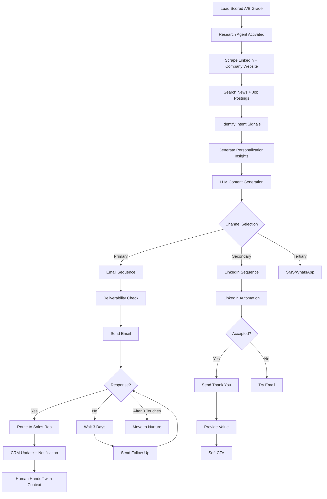
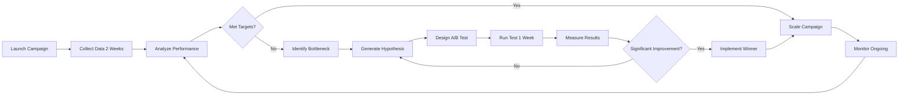

# EchoLabs AI: Intelligent Personalized Outreach Agent

## Executive Summary

EchoLabs' Personalized Outreach Agent is an AI-powered messaging system that generates ultra-personalized, culturally-aware cold outreach at scale for UAE enterprise markets. By combining LLM-based content generation, behavioral analysis, multi-channel sequencing, and regional customization, the system achieves 3-8x higher reply rates compared to generic templates while maintaining authentic, human-like communication. This document specifies the agent architecture, personalization methodology, UAE market adaptations, multi-channel orchestration, and compliance safeguards for production deployment.

**Business Impact:**
- 3-8x higher meeting booking rates vs. generic outreach (research-backed)
- 41% higher click-through rates with personalized campaigns
- 12% email reply rate (4x above traditional 3% benchmark)
- 4% conversion rate from cold outreach to qualified opportunity
- 200 hyper-personalized messages per week outperforms 2,000 generic emails

---

## Problem Statement

### Challenges in UAE Enterprise Outreach

**1. Generic, Ineffective Mass Outreach**
- Traditional "spray-and-pray" cold emails generate <1% reply rates
- Generic templates fail to resonate with UAE decision-makers
- Recipients instantly recognize and ignore templated messages
- Sales reps spend 20+ hours/week on manual personalization (unsustainable)

**2. Cultural & Regional Mismatch**
- Western-centric messaging fails in UAE/GCC markets
- Lack of Arabic language support and localization
- Poor understanding of UAE business etiquette and hierarchy
- Ignorance of regional timing (Ramadan, UAE National Day, Friday prayer times)
- Missing relationship-first communication style

**3. Multi-Channel Complexity**
- UAE enterprises expect engagement across email, LinkedIn, WhatsApp (business), SMS
- Manual multi-channel coordination is error-prone and time-consuming
- No unified view of prospect touchpoints across channels
- Different tone/format requirements for each channel

**4. Deliverability & Spam Concerns**
- Aggressive spam filters in UAE corporate networks
- Mass outreach triggers domain reputation damage
- Lack of email warm-up and sending patterns
- No monitoring of bounce rates, spam complaints, engagement metrics

**5. Scale vs. Authenticity Tension**
- Manual personalization delivers results but doesn't scale (max 20-30 emails/day)
- Automation scales but loses authenticity and human touch
- Sales reps can't research every prospect deeply
- No way to incorporate real-time signals (company news, hiring, funding)

---

## Solution Architecture

### AI-Powered Personalization at Scale

**Core Concept:**

The Personalized Outreach Agent is an autonomous system that:

1. **Researches** prospects using web scraping, LinkedIn, company databases, news APIs
2. **Analyzes** buyer signals, intent data, and contextual information
3. **Generates** ultra-personalized messages using LLMs (GPT-4, Claude, Llama 3.1)
4. **Sequences** multi-touch campaigns across email, LinkedIn, SMS
5. **Optimizes** messaging based on engagement data and A/B testing
6. **Routes** replies to appropriate sales reps with full context

**Technology Stack:**

```
Architecture Layers:

1. Data Enrichment Layer:
   - Clearbit, Apollo.io, ZoomInfo (firmographics)
   - LinkedIn Sales Navigator API (profile, activity)
   - UAE business registries (DIFC, ADGM, Chamber of Commerce)
   - News APIs (Gulf News, Arabian Business, Google News)
   - Web scraping (company websites, career pages, press releases)

2. LLM Processing Layer:
   - LangChain for workflow orchestration
   - GPT-4 / Claude 3.5 for content generation
   - Llama 3.1 (open-source) for cost-efficient drafts
   - ChromaDB for semantic memory and context retrieval
   - Elasticsearch for indexing and retrieval

3. Personalization Engine:
   - Intent signal detection (job postings, funding, news)
   - Behavioral analysis (website visits, content engagement)
   - Cultural adaptation (Arabic greetings, formality level)
   - Dynamic variable insertion (name, company, role, pain points)

4. Multi-Channel Orchestration:
   - Email automation (Instantly.ai, Outreach.io, Mailshake)
   - LinkedIn automation (Expandi, Dripify, SalesRobot)
   - SMS/WhatsApp Business API integration
   - CRM integration (HubSpot, Salesforce, Pipedrive)

5. Deliverability & Monitoring:
   - Email warm-up systems
   - Spam score checking (Mail Tester, GlockApps)
   - Domain rotation and sender reputation monitoring
   - Real-time engagement tracking and alerts
```

---

## Personalization Methodology

### 1. Research-Driven Personalization

**Data Sources for Context Gathering:**

```
Prospect-Level Research:
- LinkedIn profile: Role, tenure, skills, endorsements, recent activity
- LinkedIn posts/comments: Topics of interest, thought leadership
- Company website: About page, mission, recent news
- Career page: Job openings (AI roles signal transformation initiatives)
- Press releases: Funding rounds, partnerships, product launches
- News mentions: Industry awards, leadership changes, expansion plans
- Conference attendance: Speaking engagements, event sponsorships
- GitHub/technical blogs: Engineering culture, tech stack (for technical roles)

Company-Level Research:
- Industry, size, revenue, growth trajectory
- Recent funding rounds (Crunchbase, Magnitt for MENA)
- Technology stack (BuiltWith, Wappalyzer)
- Competitors and market positioning
- Regulatory environment (DIFC, ADGM, Federal)
- Regional presence (UAE HQ vs. international)
```

**Research Automation Workflow:**

```mermaid
graph LR
    A[Lead Enters System] --> B[Enrich Firmographics]
    B --> C[Scrape LinkedIn Profile]
    C --> D[Scrape Company Website]
    D --> E[Search Recent News]
    E --> F[Identify Job Postings]
    F --> G[Detect Intent Signals]
    G --> H[Generate Personalization Insights]
    H --> I[Store in ChromaDB]
    I --> J[Pass to LLM for Messaging]
```



### 2. LLM-Based Content Generation

**Hybrid Model Approach:**

```
Tier 1: GPT-4 / Claude 3.5 (High-Value Leads)
- A-grade leads (70+ lead score)
- C-level contacts
- Large enterprise accounts ($500M+ revenue)
- Complex, nuanced personalization required
- Cost: $0.01-0.03 per message

Tier 2: GPT-3.5 / Llama 3.1 (Medium-Value Leads)
- B-grade leads (50-69 lead score)
- VP/Director-level contacts
- Mid-market companies ($50M-$500M revenue)
- Standard personalization with proven templates
- Cost: $0.001-0.005 per message

Tier 3: Template + Variable Substitution (Low-Value Leads)
- C-grade leads (30-49 lead score)
- Manager/individual contributors
- SMEs (<$50M revenue)
- Basic personalization with name, company, role
- Cost: $0.0001 per message
```

**LLM Prompt Engineering:**

```
Core Prompt Structure:

---
You are an expert B2B sales professional specializing in UAE enterprise outreach for EchoLabs AI, an LLM evaluation, testing, and compliance platform.

Your task: Write a personalized cold outreach email to:

Prospect Details:
- Name: {first_name} {last_name}
- Title: {job_title}
- Company: {company_name}
- Industry: {industry}
- Location: {city}, {country}
- Company Size: {employee_count} employees
- Recent Activity: {recent_activity} (e.g., "Hired 3 AI engineers in last 2 months", "Announced partnership with Acme Corp", "Posted about AI governance challenges on LinkedIn")

EchoLabs Value Proposition:
- We help UAE enterprises evaluate, test, and monitor LLM/AI agents for compliance, safety, and performance
- Key differentiators: DIFC/ADGM compliance testing, Arabic language support, UAE data residency
- Target sectors: Financial Services, Government, Healthcare, Telecom, Energy

Email Requirements:
1. **Personalization**: Reference {recent_activity} naturally in opening line
2. **Relevance**: Connect our platform to their industry-specific pain points (e.g., fraud detection for banks, citizen services for government)
3. **Cultural Awareness**: Use appropriate formality for UAE business context (professional, respectful, relationship-first)
4. **Value-First**: Lead with insight or relevant statistic, not a hard sell
5. **Clear CTA**: Request 15-minute exploratory call, not generic "demo"
6. **Brevity**: 100-150 words max
7. **Tone**: Consultative, not salesy. Position as peer/advisor, not vendor

Avoid:
- Generic claims ("industry-leading," "best-in-class")
- Pushy language ("limited time offer," "act now")
- Asking for too much time (no "30-min demo")
- Mentioning competitors by name
- Using slang or idioms that don't translate well

Generate the email now:
---
```

**Example LLM Outputs:**

**Scenario 1: Financial Services CTO (DIFC Bank)**

```
Subject: {first_name}, thoughts on LLM governance for fraud detection?

Hi {first_name},

I noticed {company_name} recently posted for an "AI Risk & Compliance Lead"—a clear signal that LLM governance is top of mind for your team.

At EchoLabs, we help DIFC-regulated banks like yours evaluate LLM outputs for bias, accuracy, and compliance before they touch customer data. Our clients run adversarial tests on fraud detection models to ensure they meet CBU standards.

Given your background in risk management, I'd value 15 minutes to share how we approach LLM evaluation for financial services. Worth a brief call?

Best,
{sender_name}
{sender_title}, EchoLabs AI
```

**Scenario 2: Government CDO (Smart City Initiative)**

```
Subject: AI transparency for Dubai's citizen services

Dear {first_name},

Your recent post on LinkedIn about "AI explainability in government" resonated—transparency is critical when AI impacts public services.

EchoLabs specializes in evaluating AI systems for safety, bias, and compliance in UAE government contexts. We've worked with entities navigating NDMO guidelines for Arabic-language chatbots and automated decision systems.

Would you be open to a 15-minute conversation about how we help government teams audit AI outputs before citizen-facing deployment?

Respectfully,
{sender_name}
{sender_title}, EchoLabs AI
```

**Scenario 3: Healthcare CIO (Insurance)**

```
Subject: HIPAA-equivalent compliance for LLMs in UAE healthcare

Hi {first_name},

Congratulations on {company_name}'s expansion into telehealth—I saw the announcement last week.

As you scale AI-powered claims processing, ensuring patient data privacy and regulatory compliance will be critical. EchoLabs helps UAE healthcare orgs test LLMs for HIPAA-equivalent compliance, bias in treatment recommendations, and Arabic language accuracy.

Would 15 minutes next week work to discuss how we support healthcare AI deployments?

Best regards,
{sender_name}
{sender_title}, EchoLabs AI
```

### 3. Dynamic Variable Insertion

**Standard Variables (All Messages):**

```
Basic Personalization:
{{first_name}} - Prospect's first name
{{last_name}} - Prospect's last name
{{company_name}} - Company name
{{job_title}} - Current role/title
{{city}} - City location
{{industry}} - Industry vertical
{{company_size}} - Employee count range
```

**Advanced Variables (AI-Generated):**

```
Dynamic Contextual Variables:
{{recent_activity}} - Latest LinkedIn post, company news, job posting
{{pain_point}} - Industry-specific challenge (AI-inferred)
{{mutual_connection}} - Shared LinkedIn connection
{{event_attended}} - Recent conference/webinar participation
{{tech_stack}} - Technologies used (BuiltWith scraping)
{{funding_news}} - Recent funding round or M&A
{{compliance_context}} - Relevant regulation (DIFC, ADGM, NDMO)
{{custom_insight}} - AI-generated unique insight based on research
```

**Spintax for Variation:**

```
Example Spintax Pattern:

Subject Lines:
{first_name}, {thoughts on|quick question about|insight on} {LLM governance|AI compliance|agent evaluation}?

Greetings:
{Hi|Hello|Dear} {first_name},

Openers:
I {noticed|saw|came across} {company_name} {recent_activity}—{impressive|exciting|noteworthy} {move|development|initiative}.

CTAs:
{Would|Could} {you|{first_name}} {be open to|have time for|be interested in} a {15-minute|brief} {call|conversation|chat} {next week|this week|soon}?
```

---

## UAE Market Adaptations

### 1. Cultural & Linguistic Customization

**Arabic Language Support:**

```
Arabic Personalization Triggers:
- Prospect's LinkedIn profile language: Arabic → Send bilingual email (Arabic subject + English body with Arabic greeting)
- Company website language: Arabic → Add Arabic greeting and closing
- Prospect location: Arabic-speaking country → Use Arabic honorifics

Arabic Greetings:
Formal:
"السلام عليكم {first_name}،" (As-salaam alaikum)
"تحية طيبة {first_name}،" (Warm greetings)

Closings:
"مع خالص التقدير،" (With sincere appreciation)
"أطيب التحيات،" (Best regards)

Honorifics:
- Sheikh/Sheikha (Royal family)
- Dr. (Doctor, Professor)
- Eng. (Engineer)
- Mr./Ms. maintained from Western naming
```

**Formality Levels:**

```
Formality Matrix (UAE Context):

C-Level Contacts:
- Use full title: "Dear Dr. [Last Name]," or "Dear Sheikh [First Name],"
- Formal tone throughout
- Reference relationships: "I was referred by [Mutual Connection]"
- Respectful CTAs: "Would you be open to..." not "Let's schedule..."

VP/Director Level:
- Semi-formal: "Dear [First Name]," or "Hi [First Name],"
- Professional but warmer tone
- Balance relationship-building with value proposition

Manager/IC Level:
- Informal: "Hi [First Name],"
- Conversational tone
- Direct value proposition
```

**Timing & Scheduling Awareness:**

```
UAE Business Calendar Adaptations:

Automatic Outreach Pauses:
- Ramadan: Pause all cold outreach during fasting hours (dawn to sunset)
- Eid Al-Fitr: Pause 3 days before to 7 days after
- Eid Al-Adha: Pause 3 days before to 7 days after
- UAE National Day (Dec 2): Pause outreach
- Friday: No outreach (day of prayer)

Optimal Send Times (GST - Gulf Standard Time):
- Sunday-Thursday: 9:00 AM - 1:00 PM (morning sessions)
- Sunday-Thursday: 3:00 PM - 6:00 PM (afternoon sessions)
- Avoid: 1:00 PM - 3:00 PM (lunch/prayer break)
- Avoid: After 6:00 PM (family time)
```

**Relationship-First Messaging:**

```
UAE Relationship Signals (High Priority):

1. Referrals & Warm Introductions:
   - Template: "[Mutual Connection] suggested I reach out..."
   - Bonus: +10 lead score points
   - Follow-up: Always mention referrer in first line

2. Shared Community:
   - "I saw you're also part of [Dubai AI Community / GITEX participant]..."
   - Build affinity before pitching

3. Shared Experiences:
   - "I attended your session at [Event]—insightful perspective on..."
   - Reference specific content from their presentation

4. Mutual Respect:
   - "Your work on [Project/Initiative] is impressive..."
   - Lead with genuine compliment, not flattery
```

### 2. Sector-Specific Messaging

**Financial Services (DIFC/ADGM Banks):**

```
Key Pain Points:
- Fraud detection accuracy and false positives
- Regulatory compliance (CBU, DFSA, ADGM FSA)
- Model risk management and explainability
- Arabic language support for customer-facing AI
- Data residency and sovereignty requirements

Messaging Angles:
- Lead with compliance: "DIFC-compliant LLM evaluation"
- Reference regulations: "CBU guidelines for AI in banking"
- Risk management focus: "Reduce model risk exposure"
- ROI metrics: "Cut false positives by 40%"

Example Hook:
"With CBU's new AI risk management guidelines, how is {company_name} validating LLM outputs for fraud detection before production deployment?"
```

**Government & Smart Cities:**

```
Key Pain Points:
- Transparency and explainability for citizens
- Arabic language accuracy and cultural sensitivity
- Data sovereignty and privacy (NDMO compliance)
- Bias in automated decision-making
- Public trust and accountability

Messaging Angles:
- Citizen-centric: "Ensure AI fairness for all Emirates residents"
- Transparency: "Audit trails for automated government decisions"
- Arabic excellence: "Native Arabic LLM evaluation"
- Smart city alignment: "Support Dubai 10X and Abu Dhabi Economic Vision 2030"

Example Hook:
"As {company_name} expands AI-powered citizen services, how are you ensuring transparency and fairness in automated decisions across 200+ nationalities?"
```

**Healthcare & Insurance:**

```
Key Pain Points:
- Patient data privacy and HIPAA-equivalent compliance
- Bias in treatment recommendations and claims processing
- Diagnostic accuracy and liability concerns
- Arabic medical terminology accuracy
- Integration with legacy EMR/EHR systems

Messaging Angles:
- Safety-first: "Validate AI diagnostic recommendations before patient impact"
- Compliance: "HIPAA-equivalent testing for UAE healthcare AI"
- Bias detection: "Ensure equitable treatment across demographics"
- Arabic medical NLP: "Accurate Arabic symptom and diagnosis processing"

Example Hook:
"With {company_name}'s expansion into AI-powered claims, how are you testing for bias in denial rates across patient demographics?"
```

---

## Multi-Channel Orchestration

### 1. Email Outreach (Primary Channel)

**Email Sequence Structure:**

```
3-Step Email Sequence (Optimal for UAE):

Email 1 (Day 0): Value-First Personalized Intro
- Subject: Personalized question or insight
- Body: Research-driven opener + brief value prop + soft CTA
- Length: 100-150 words
- CTA: "Worth a brief call?"

Email 2 (Day 4): Case Study or Social Proof
- Subject: "Quick follow-up" or reference to their industry
- Body: Sector-specific case study (e.g., "How DIFC Bank X reduced false positives by 40%")
- Length: 80-120 words
- CTA: "Would you like to see how we approach [their pain point]?"

Email 3 (Day 8): Break-Up or Value Add
- Subject: "Last note" or "One more thing"
- Body: Offer free resource (AI Readiness Audit, Compliance Checklist) with no ask
- Length: 60-80 words
- CTA: "No pressure—here's a free [resource] either way."
```

**Email Deliverability Best Practices:**

```
Domain & Infrastructure:
- Use dedicated sending domains (separate from primary company domain)
- SPF, DKIM, DMARC records properly configured
- Warm-up new domains: 50 emails/day for 2 weeks, increase by 50/day
- Maintain sender reputation >95% (monitor with Google Postmaster Tools)

Sending Patterns:
- Stagger sends: No more than 200 emails/hour per domain
- Randomize send times: Human-like patterns (not exactly on the hour)
- Personalized "From" names: "Ahmed from EchoLabs" not "EchoLabs Sales"
- Reply-to: Use real email addresses that receive replies

Content Hygiene:
- Avoid spam trigger words: "free," "guarantee," "limited time," "act now"
- Text-to-image ratio: >60% text
- No excessive links: Max 2-3 links per email
- No URL shorteners: Use full URLs for transparency
- Include unsubscribe link: Legal requirement + reputation protection
```

### 2. LinkedIn Outreach (Secondary Channel)

**LinkedIn Sequence Structure:**

```
4-Touch LinkedIn Sequence:

Touch 1 (Day 0): Profile Visit
- Action: Visit prospect's LinkedIn profile (triggers notification)
- No message sent yet
- Establishes initial awareness

Touch 2 (Day 2): Connection Request
- Personalized message (max 300 characters):
  "Hi {first_name}, I saw your recent post on [topic]—insightful perspective. I work with UAE enterprises on LLM governance. Would value connecting."
- Mention specific post or shared interest
- No hard pitch

Touch 3 (Day 5 - If Accepted): Thank You + Value
- Message: "Thanks for connecting, {first_name}. Given your work in [industry], thought you might find this [resource/article] useful: [link]. No ask—just sharing."
- Provide value first, no CTA

Touch 4 (Day 10 - If Engaged): Soft CTA
- Message: "Hi {first_name}, following up on that [resource]. Given {company_name}'s focus on [initiative], curious if you've explored LLM evaluation yet? Happy to share how we support [industry] teams. Worth a brief call?"
- Reference previous interaction
- Conversational CTA
```

**LinkedIn Automation Safety:**

```
LinkedIn Limits (Avoid Restrictions):
- Connection requests: Max 100/week (20/day)
- Messages: Max 150/week (30/day)
- Profile visits: Max 250/week (50/day)
- Delays between actions: 30-60 seconds randomized
- Cloud-based automation: Use Expandi, Dripify (not desktop-based)

Best Practices:
- Send from personal profiles (not company pages)
- Engage with prospect's content before connecting (like, comment)
- Use Sales Navigator for advanced search and InMails
- Withdraw old pending invites (LinkedIn penalizes >50% acceptance rate)
```

### 3. SMS/WhatsApp (Tertiary Channel)

**Use Cases for SMS/WhatsApp:**

```
When to Use SMS/WhatsApp:
1. High-value leads (A-grade, C-level) who haven't responded to email/LinkedIn
2. Prospects who explicitly provided mobile numbers (form submission)
3. Follow-up after initial engagement (e.g., demo scheduled, then reminder)
4. Regional preference: UAE executives often prefer WhatsApp for business

When NOT to Use:
1. Cold, unsolicited first touch (privacy concerns, illegal in some cases)
2. Bulk messaging to purchased lists (spam, reputation damage)
3. Without explicit consent or opt-in
```

**WhatsApp Business API (Compliant Approach):**

```
WhatsApp Business Integration:
- Use official WhatsApp Business API (not personal WhatsApp)
- Obtain consent: "May we contact you via WhatsApp for AI insights?"
- Template messages: Pre-approved by WhatsApp for compliance
- Personalization within templates: {{1}}, {{2}} variables
- Opt-out mechanism: "Reply STOP to unsubscribe"

Example WhatsApp Message (Post-Consent):
"Hi {{1}}, Ahmed from EchoLabs here. Following up on our conversation about LLM evaluation for {{2}}. Would next Tuesday 10 AM GST work for a brief call? Reply YES or suggest another time."
```

---

## Agent Workflow & Automation

### End-to-End Workflow



### Intelligent Routing Rules

```
Response Routing Logic:

1. Positive Intent Signals (Immediate Handoff):
   - Keywords: "yes," "interested," "call," "demo," "meeting," "available"
   - Action: Slack notification to assigned AE + auto-create CRM task
   - SLA: Sales rep responds within 2 hours

2. Question/Clarification (Nurture Sequence):
   - Keywords: "tell me more," "what does," "how does," "pricing," "case study"
   - Action: AI-powered auto-reply with relevant info + human review in 24 hours
   - Follow-up: AE joins thread with personalized response

3. Objection/Not Interested:
   - Keywords: "not interested," "not now," "timing," "budget," "already have"
   - Action: Move to 6-month nurture sequence
   - Follow-up: Quarterly value-add touchpoints (no hard sell)

4. Out-of-Office / Auto-Reply:
   - Detection: "out of office," "vacation," "auto-reply"
   - Action: Pause sequence, resume after detected return date
   - Smart retry: Send follow-up 2 days after OOO end

5. Unsubscribe / Stop:
   - Keywords: "unsubscribe," "stop," "remove," "opt-out"
   - Action: Immediate suppression from all lists
   - Compliance: Add to global do-not-contact list
```

---

## A/B Testing & Optimization

### Continuous Improvement Framework

**Test Variables:**

```
Subject Line Testing:
- Question vs. statement: "Thoughts on LLM governance?" vs. "LLM governance for UAE banks"
- Personalization level: "{{first_name}}, quick question" vs. "Quick question"
- Length: Short (3-5 words) vs. medium (6-8 words)
- Formality: Formal vs. casual

Email Body Testing:
- Opener: Research insight vs. direct value prop
- Length: 100 words vs. 150 words
- CTA: Question vs. statement ("Worth a call?" vs. "Let's schedule a call")
- Value placement: Lead with pain point vs. lead with solution

Timing Testing:
- Send time: Morning (9-11 AM) vs. afternoon (3-5 PM)
- Day of week: Sunday-Tuesday vs. Wednesday-Thursday
- Sequence cadence: 3 days vs. 4 days vs. 7 days between touches

Channel Testing:
- Email-first vs. LinkedIn-first
- Multi-channel (email + LinkedIn) vs. single-channel
- SMS inclusion vs. no SMS
```

**Metrics Tracking:**

```
Key Performance Indicators:

Deliverability Metrics:
- Bounce rate: <2% (hard bounces <0.5%)
- Spam complaint rate: <0.1%
- Unsubscribe rate: <0.5%
- Domain reputation score: >95%

Engagement Metrics:
- Open rate: Target 40-60% (personalized subject lines)
- Click-through rate: Target 8-15%
- Reply rate: Target 4-12% (8%+ is excellent)
- Positive reply rate: Target 50-70% of replies

Conversion Metrics:
- Meeting booked rate: Target 2-4% of total sends
- Show-up rate: Target 70-80% of booked meetings
- Opportunity created rate: Target 30-50% of meetings
- Lead-to-customer rate: Track cohort-based (6-18 month sales cycle)

Efficiency Metrics:
- Time saved per rep: Target 15+ hours/week
- Cost per reply: Target <$5
- Cost per meeting: Target <$50
- Messages sent per rep per week: Target 200-300 personalized
```

**Optimization Cycle:**



---

## Compliance & Ethics

### Legal & Regulatory Adherence

**UAE Data Protection & Privacy:**

```
Compliance Requirements:

1. UAE Federal Data Protection Law:
   - Obtain consent for data processing (email collection)
   - Right to erasure: Honor unsubscribe requests immediately
   - Data minimization: Collect only necessary information
   - Secure storage: Encrypt prospect data at rest and in transit

2. DIFC Data Protection Law (for DIFC entities):
   - GDPR-equivalent requirements
   - Lawful basis for processing: Legitimate interest (B2B outreach)
   - Data protection impact assessment for automated decision-making
   - Appoint Data Protection Officer if processing large volumes

3. ADGM Data Protection Regulations:
   - Similar to DIFC, GDPR-aligned
   - Cross-border data transfer restrictions (UAE data residency preferred)
   - Notification requirements for data breaches

4. CAN-SPAM Act (for US recipients):
   - Include physical address in email footer
   - Clear unsubscribe mechanism
   - Honor opt-outs within 10 days
   - No misleading subject lines or "from" names
```

**Ethical AI Practices:**

```
Ethical Guidelines for AI-Generated Outreach:

1. Transparency:
   - Disclose AI assistance if asked ("How did you personalize this?")
   - Never impersonate humans in fully automated conversations
   - Clear identification: Emails from "Ahmed (EchoLabs AI)" not "Ahmed [Personal Email]"

2. Authenticity:
   - Human review for all A-grade leads (C-level, high-value)
   - AI generates drafts, humans approve and refine
   - No misleading claims or fabricated research
   - Verify all facts before inclusion in messages

3. Respect:
   - Honor opt-outs immediately and permanently
   - No re-adding of unsubscribes to new lists
   - Respect cultural and religious sensitivities (Ramadan, prayer times)
   - No aggressive or manipulative language

4. Data Stewardship:
   - Delete prospect data upon request
   - No selling or sharing of prospect lists
   - Secure storage with access controls
   - Regular audits of data usage and retention
```

---

## Implementation Roadmap

### Phase 1: Email Foundation (Weeks 1-4)

```
Objectives:
- Set up email infrastructure and automation platform
- Implement basic personalization (name, company, role)
- Launch first 3-step email sequence for pilot segment
- Establish deliverability monitoring

Tasks:
- Configure sending domains with SPF/DKIM/DMARC
- Integrate Instantly.ai or Outreach.io
- Connect CRM (HubSpot/Salesforce)
- Design email templates with variable placeholders
- Set up warm-up sequences (2 weeks)
- Launch pilot: 100 leads/week, financial services sector

Deliverables:
- Email infrastructure operational
- 3-step sequence templates approved
- Deliverability baseline established (>95% inbox rate)
- Initial campaign performance report

Success Criteria:
- >40% open rate
- >3% reply rate
- <2% bounce rate
- Zero spam complaints
```

### Phase 2: LLM Integration (Weeks 5-8)

```
Objectives:
- Integrate LLM-based content generation
- Implement research automation (LinkedIn, news, company websites)
- Launch hyper-personalized sequences with AI-generated insights
- Expand to 3 sectors (financial services, government, healthcare)

Tasks:
- Set up LangChain + GPT-4 API integration
- Build research agent (Clearbit, Apollo, web scraping)
- Design LLM prompts for each sector
- Implement ChromaDB for context storage
- A/B test: AI-personalized vs. template-based
- Train sales team on reviewing AI drafts

Deliverables:
- Research agent operational
- LLM-generated messages in production
- A/B test results and winner selection
- Expanded campaign to 300 leads/week

Success Criteria:
- >8% reply rate (AI-personalized)
- 2x improvement vs. templates
- Sales team satisfaction >4/5 on message quality
```

### Phase 3: Multi-Channel (Weeks 9-12)

```
Objectives:
- Add LinkedIn automation
- Implement SMS/WhatsApp for high-value leads
- Orchestrate multi-channel sequences
- UAE-specific timing and cultural adaptations

Tasks:
- Integrate Expandi or Dripify for LinkedIn
- Set up WhatsApp Business API
- Build multi-channel orchestration logic
- Implement Ramadan/holiday pause automation
- Add Arabic greetings and formality rules
- Launch 5-touch multi-channel sequence (email + LinkedIn + SMS)

Deliverables:
- LinkedIn automation live
- Multi-channel sequences operational
- UAE adaptations implemented
- Campaign scaled to 500 leads/week

Success Criteria:
- >12% reply rate (multi-channel)
- >4% meeting booked rate
- LinkedIn acceptance rate >40%
- Zero LinkedIn restrictions
```

### Phase 4: Optimization & Scale (Weeks 13-16)

```
Objectives:
- Continuous A/B testing and optimization
- Expand to all 5 sectors
- Implement advanced intent signals (funding, hiring, news)
- Scale to 1,000+ leads/week

Tasks:
- Set up automated A/B testing framework
- Integrate intent data providers (Bombora, 6sense)
- Build sector-specific LLM prompts and sequences
- Implement advanced routing (geographic, industry, seniority)
- Develop ROI dashboard for sales leadership

Deliverables:
- A/B testing framework operational
- All 5 sectors covered with custom sequences
- Intent-triggered campaigns launched
- Scaled to 1,000 leads/week

Success Criteria:
- Sustained >10% reply rate across all sectors
- >3% conversion to opportunity
- 15+ hours/week saved per sales rep
- ROI >8x on outreach system investment
```

---

## Cost-Benefit Analysis

### Implementation Costs

**One-Time Setup:**

```
- Development (LLM integration, research agent): 300-400 hours @ $100/hr = $30,000-$40,000
- Email infrastructure setup: $2,000-$3,000
- CRM integration: 40-60 hours @ $100/hr = $4,000-$6,000
- Sales team training: 20 hours = $2,000

Total One-Time: $38,000-$51,000
```

**Recurring Costs (Annual):**

```
Software/APIs:
- Instantly.ai or Outreach.io: $6,000-$12,000/year
- LinkedIn automation (Expandi/Dripify): $3,000-$4,800/year
- Clearbit enrichment: $12,000/year
- Apollo.io: $6,000/year
- GPT-4 API (200K messages/year): $2,000-$6,000/year
- ChromaDB hosting: $1,200/year
- Email sending (SendGrid/Mailgun): $1,200/year
- WhatsApp Business API: $1,200/year

Maintenance:
- System monitoring and optimization: $15,000/year
- Ongoing training and updates: $5,000/year

Total Annual: $52,600-$63,400
```

### Expected ROI (Year 1)

**Efficiency Gains:**

```
Sales Rep Time Savings:
- Baseline: 5 reps × 20 hours/week on manual outreach = 100 hours/week
- Post-automation: 5 reps × 5 hours/week (reviewing AI drafts, responding) = 25 hours/week
- Time saved: 75 hours/week × 48 weeks = 3,600 hours/year
- Value at $100/hour: $360,000/year

Meeting Generation Improvement:
- Baseline: 200 manual emails/week × 3% reply rate × 50% meeting rate = 3 meetings/week
- Post-automation: 1,000 AI emails/week × 10% reply rate × 60% meeting rate = 60 meetings/week
- Additional meetings: 57/week × 48 weeks = 2,736 meetings/year
- Opportunity rate: 30% of meetings = 821 opportunities/year
- Close rate: 15% of opportunities = 123 deals/year
- Average deal value: $50,000
- Additional revenue: $6,150,000/year

Conservative ROI Calculation (First Year):
Total Benefit: $360,000 (time saved) + $6,150,000 (revenue) = $6,510,000
Total Cost: $51,000 (setup) + $63,400 (annual) = $114,400
Year 1 ROI: 5,590% (56x return)
```

---

## Success Metrics & KPIs

### 30-Day Success Criteria

```
✓ Email infrastructure operational with >95% deliverability
✓ 3-step sequence launched for pilot segment (100 leads)
✓ >40% open rate achieved
✓ >3% reply rate achieved
✓ Zero spam complaints or domain reputation issues
✓ Sales team trained on reviewing AI-generated drafts
```

### 90-Day Success Criteria

```
✓ LLM-powered personalization operational
✓ >8% reply rate achieved (AI-personalized messages)
✓ Multi-channel sequences (email + LinkedIn) launched
✓ 300+ leads per week being contacted
✓ >2% meeting booked rate
✓ Sales team satisfaction >4/5 on outreach quality
```

### 1-Year Success Criteria

```
✓ Sustained >10% reply rate across all sectors
✓ >4% meeting booked rate
✓ >3% conversion to qualified opportunity
✓ 1,000+ leads per week outreach capacity
✓ 15+ hours/week saved per sales rep
✓ ROI >8x on outreach system investment
✓ Expansion to all 5 UAE target sectors
```

---

## Sources & References

### Research Sources

1. **IEEE (2025).** "AI-Powered Cold Email Automation for Staffing Solutions"
   - 9% email response rate, 4% conversion rate with LLM-based personalization
   - Source: [source:54]

2. **IRJAEH (2025).** "AI-Powered Cold Email Generator and Personalized Outreach Platform"
   - LLaMA 3.1, ChromaDB, LangChain implementation patterns
   - Source: [source:55]

3. **Nukesend (2025).** "B2B Cold Outreach Trends: What's Actually Working in 2025"
   - 12% cold email reply rate with intent-based triggers and AI personalization
   - Source: [source:71]

4. **Instantly.ai (2024).** "Leveraging AI For Email Writing: Best Tools & Strategies"
   - AI sequence generation methodology and custom variables
   - Source: [source:72]

5. **SAP (2025).** "How AI agents can empower sales teams"
   - Conversational AI agent architecture and multi-agent coordination
   - Source: [source:73]

6. **Stamina Sales (2024).** "The Ultimate Guide to Cold Outreach That Converts in 2025"
   - 139% engagement boost with multichannel outreach
   - Source: [source:74]

7. **N8N (2025).** "Smart Email Outreach Sequence – AI-Powered & Customizable"
   - Domain-based outreach and AI-powered personalization workflows
   - Source: [source:75]

8. **Pete & Gabi (2025).** "Sales Automation: Top 10 AI Call Agents Leading the Charge"
   - Conversational AI for sales automation and lead qualification
   - Source: [source:76]

9. **Dripify (2025).** "AI Hyper-Personalized Cold Email and LinkedIn Outreach"
   - 8x more replies with hyper-personalization and AI IceBreaker
   - Source: [source:77]

10. **AI Acquisition (2025).** "28 Proven AI Sales Agents to Automate and Scale Your Sales"
    - AI agent workflows for prospecting, qualification, and nurturing
    - Source: [source:79]

11. **Hunter.io (2024).** "How To Use AI For Cold Email In 2025 (Guide)"
    - Deliverability best practices and reply-first economy trends
    - Source: [source:80]

12. **Octopus Marketing Agency Dubai (2025).** "Cold Email Outreach Service in Dubai"
    - UAE-specific outreach strategies and cultural adaptations
    - Source: [source:44]

13. **Digital Orks (2024).** "LinkedIn Cold Outreach Services in Dubai"
    - Middle East LinkedIn personalization and automation best practices
    - Source: [source:47]

---

## Appendix: Example Outreach Sequences

### Sequence 1: Financial Services (DIFC Bank CTO)

**Email 1 (Day 0):**
```
Subject: Ahmed, thoughts on LLM governance for fraud detection?

Hi Ahmed,

I noticed Emirates Global Bank recently posted for an "AI Risk & Compliance Lead"—a clear signal that LLM governance is top of mind for your team.

At EchoLabs, we help DIFC-regulated banks like yours evaluate LLM outputs for bias, accuracy, and compliance before they touch customer data. Our clients run adversarial tests on fraud detection models to ensure they meet CBU standards.

Given your background in risk management, I'd value 15 minutes to share how we approach LLM evaluation for financial services. Worth a brief call?

Best,
Yusuf Al-Mansoori
Head of Financial Services, EchoLabs AI
```

**Email 2 (Day 4):**
```
Subject: Quick follow-up: DIFC compliance for AI

Hi Ahmed,

Following up on my last note about LLM evaluation for fraud detection.

Thought you might find this case study relevant: We helped DIFC Bank X reduce false positives in their fraud detection model by 42% while ensuring CBU compliance for automated decision-making.

The key was pre-deployment testing for:
- Bias in transaction flagging across demographics
- Explainability of AI decisions for regulators
- Arabic language accuracy in customer communications

Would you like to see how we approach this for financial services? Happy to share our DIFC compliance framework.

Best,
Yusuf
```

**Email 3 (Day 8):**
```
Subject: Last note + free resource

Hi Ahmed,

Last follow-up from me—no pressure either way.

Even if LLM evaluation isn't a priority right now, I wanted to share our "UAE AI Compliance Checklist for Financial Services" (free download, no form). It covers DIFC, ADGM, and CBU requirements for AI deployments.

Link: [URL]

If you'd ever like to discuss your AI governance approach, I'm here. Otherwise, best of luck with your AI initiatives.

Respectfully,
Yusuf Al-Mansoori
EchoLabs AI
```

**LinkedIn Touch (Day 6 - If No Email Reply):**
```
Hi Ahmed,

I sent you a couple of emails about LLM evaluation for fraud detection, but wanted to try LinkedIn in case email didn't reach you.

Given Emirates Global Bank's AI hiring push, curious if you've explored governance frameworks for LLM-powered fraud systems yet?

Happy to share how we help DIFC banks ensure compliance before production deployment. Worth a brief call?

Best,
Yusuf
```

---

**END OF DOCUMENT**